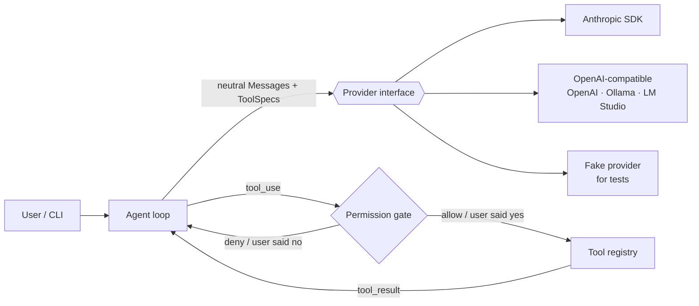

# matchuco

🇧🇷 [Versão em português](#versão-em-português)

A multi-provider **agentic harness** built from scratch in Python — a learning
project that reimplements the core ideas behind
[Claude Code](https://code.claude.com/docs/en/how-claude-code-works): the
agentic loop, tools, permissions, context management, sessions, subagents,
hooks, skills, MCP and evals.

> An *agentic harness* is the layer around a model that gives it tools and
> manages what it sees. The model reasons; the harness acts.

## Status

| Phase | Topic | Status |
| --- | --- | --- |
| 0 | Project setup (uv, ruff, mypy, pytest, CI) | ✅ |
| 1 | Provider abstraction: Anthropic, OpenAI-compatible (OpenAI, Ollama, ...), fake | ✅ |
| 2 | Agentic loop + core tools (read, write, edit, glob, grep, shell) | ✅ |
| 3 | Permissions: modes (default, accept_edits, plan, bypass) and allow/ask/deny rules | ✅ |
| 4 | Context engineering: AGENTS.md/CLAUDE.md, environment, token tracking, compaction | ✅ |
| 5 | Sessions (JSONL), resume/fork, checkpoints + rewind, auto memory | ⏳ |
| 6 | Subagents | ⏳ |
| 7 | Hooks and skills | ⏳ |
| 8 | MCP client | ⏳ |
| 9 | Evals | ⏳ |

## Architecture



The whole harness works on **provider-neutral types**
([`messages.py`](src/matchuco/messages.py)): `Message`s made of `TextBlock`,
`ToolUseBlock`, `ToolResultBlock`, `ThinkingBlock` and `OpaqueBlock`. Each
provider adapter translates to and from its wire format and streams back
`TextDelta` / `ThinkingDelta` / `ToolUseStart` events, ending with `Done`.

### The agent loop

One prompt can take many model turns. [`agent.py`](src/matchuco/agent.py)
sends the conversation plus the tool schemas, runs whatever tools the model
asks for, feeds the results back, and repeats until the model answers without
calling a tool — bounded by `--max-steps`.

A tool that fails is **not** an exception: bad arguments, a missing file or a
non-zero exit code all come back as a `tool_result` marked as an error, so the
model can read it and try something else.

### Tools

| Tool | What it does |
| --- | --- |
| `glob` | find files by name pattern, newest first |
| `grep` | regex search inside files |
| `read` | read a file with line numbers, paged |
| `edit` | replace an exact, unique string |
| `write` | write a whole file |
| `shell` | run a command, merged stdout/stderr + exit code |
| `exit_plan_mode` | hand a finished plan to the user for approval |

Each tool declares a pydantic model for its input, so the JSON Schema the model
sees and the runtime validation come from one source. `write` and `edit`
refuse to touch a file that has not been read this session, and every path is
resolved inside the workspace root.

### Permissions

Every tool call passes a gate ([`permissions.py`](src/matchuco/permissions.py))
between argument validation and execution. The decision combines the session
**mode**, **rules** from settings, and the tool's **kind** (read / edit /
execute / plan):

| Mode | Reads | File edits | Commands |
| --- | --- | --- | --- |
| `default` | allowed | ask | ask |
| `accept_edits` | allowed | allowed | ask |
| `plan` | allowed | denied | denied |
| `bypass` | allowed | allowed | allowed |

```json
// .matchuco/settings.json (project) — also ~/.matchuco/ (user) and settings.local.json
{
  "permissions": {
    "allow": ["shell(uv run pytest *)", "edit(docs/**)"],
    "ask":   ["shell(git push *)"],
    "deny":  ["read(.env)", "shell(rm *)"]
  }
}
```

Deny rules win over everything, including `bypass`. Shell rules are matched
per sub-command, so `git status && rm -rf ~` does not ride on an allow rule
for `git *`, and commands with substitutions or redirections are never
auto-approved. A denial is returned to the model as an error `tool_result` —
with the user's instructions if they typed any — so it can change course.

In **plan mode** the model can only read; it proposes a plan through
`exit_plan_mode`, and approving it switches the session back to editing.
Shift+Tab cycles modes in the REPL.

### Context engineering

[`context.py`](src/matchuco/context.py) assembles the system prompt once per
session — base prompt, an environment snapshot (OS, the shell the `shell`
tool really uses, git branch and status) and `AGENTS.md` / `CLAUDE.md` files
from the user dir, the repo root down to the workspace, and `AGENTS.local.md`
— and then freezes it. The history is **append-only**: anything that changes
mid-session is appended, never edited in, which keeps the provider's prompt
cache warm and keeps reasoning blocks valid on models that bind them to the
exact prefix.

Context usage is measured from the provider-reported size of the last request
plus an estimate (~4 chars/token) of what was appended since. At 80% of the
window the conversation is **compacted**: the model summarizes it and the
summary replaces the whole history (no verbatim tail, never mid tool round),
with a guard against compaction thrashing. `/context` shows the breakdown,
`/compact [focus]` compacts on demand, and a `## Compact Instructions`
section in `AGENTS.md` tells the summarizer what to keep.

## Quickstart

Requires [uv](https://docs.astral.sh/uv/).

```bash
uv sync
cp .env.example .env   # add ANTHROPIC_API_KEY and/or OPENAI_API_KEY
uv run matchuco                          # interactive agent (default: anthropic)
uv run matchuco --provider openai        # gpt-5.4-mini by default
uv run matchuco --provider ollama --model qwen3-coder   # local, free
uv run matchuco --provider fake -p "hi"  # no API key needed
uv run matchuco --cwd ../other-repo      # point the tools at another workspace
uv run matchuco --mode plan              # read-only: explore, then propose a plan
uv run matchuco --context-window 20000   # a small window, to watch compaction happen
```

## Development

```bash
uv run pytest        # tests run offline against the fake provider and SDK types
uv run ruff check .
uv run mypy          # strict mode
```

## Learning notes

Each phase has a write-up (in Portuguese) explaining the concept behind it:
[`docs/`](docs/).

## License

MIT

---

## Versão em português

Uma **agentic harness** multi-provedor construída do zero em Python. É um
projeto de estudo que reimplementa as ideias centrais do
[Claude Code](https://code.claude.com/docs/pt/how-claude-code-works): loop
agentic, ferramentas, permissões, gerenciamento de contexto, sessões,
subagents, hooks, skills, MCP e evals.

> Uma *agentic harness* é a camada em volta do modelo que lhe dá ferramentas e
> controla o que ele vê. O modelo raciocina; a harness age.

### Status

| Fase | Tema | Status |
| --- | --- | --- |
| 0 | Setup do projeto (uv, ruff, mypy, pytest, CI) | ✅ |
| 1 | Abstração de provedores: Anthropic, compatíveis com OpenAI (OpenAI, Ollama...), fake | ✅ |
| 2 | Loop agentic + ferramentas (read, write, edit, glob, grep, shell) | ✅ |
| 3 | Permissões: modos (default, accept_edits, plan, bypass) e regras allow/ask/deny | ✅ |
| 4 | Context engineering: AGENTS.md/CLAUDE.md, ambiente, contagem de tokens, compactação | ✅ |
| 5 | Sessões (JSONL), resume/fork, checkpoints + rewind, auto memory | ⏳ |
| 6 | Subagents | ⏳ |
| 7 | Hooks e skills | ⏳ |
| 8 | Cliente MCP | ⏳ |
| 9 | Evals | ⏳ |

### Como funciona

- **Tipos neutros de provedor** ([`messages.py`](src/matchuco/messages.py)):
  todo o resto da harness fala um formato único de mensagem; cada adaptador de
  provedor traduz para o formato da sua API e transmite a resposta em streaming.
- **Loop agentic** ([`agent.py`](src/matchuco/agent.py)): envia a conversa e os
  schemas das ferramentas, executa o que o modelo pedir, devolve os resultados
  e repete até o modelo responder sem chamar ferramentas (limitado por
  `--max-steps`). Uma ferramenta que falha vira um `tool_result` de erro, não
  uma exceção, para o modelo poder se corrigir.
- **Permissões** ([`permissions.py`](src/matchuco/permissions.py)): toda tool
  call passa por um portão que combina o **modo** da sessão, **regras** de
  `settings.json` e o **tipo** da ferramenta. Regras `deny` vencem tudo;
  comandos compostos são avaliados por subcomando; no plan mode o modelo só lê
  e apresenta um plano via `exit_plan_mode`.
- **Contexto** ([`context.py`](src/matchuco/context.py)): o system prompt é
  montado uma vez por sessão (prompt base, snapshot do ambiente e arquivos
  `AGENTS.md`/`CLAUDE.md`) e congelado; o histórico é *append-only*, o que
  mantém o prompt cache aquecido. O uso do contexto vem do tamanho reportado
  pelo provedor mais uma estimativa do que entrou depois; a 80% da janela a
  conversa é **compactada** num resumo. `/context` mostra a ocupação e
  `/compact [foco]` compacta sob demanda.

### Início rápido

Requer [uv](https://docs.astral.sh/uv/).

```bash
uv sync
cp .env.example .env   # adicione ANTHROPIC_API_KEY e/ou OPENAI_API_KEY
uv run matchuco                          # agente interativo (padrão: anthropic)
uv run matchuco --provider openai        # gpt-5.4-mini por padrão
uv run matchuco --provider ollama --model qwen3-coder   # local, grátis
uv run matchuco --provider fake -p "oi"  # sem chave de API
uv run matchuco --mode plan              # só leitura: explora e propõe um plano
uv run matchuco --context-window 20000   # janela pequena, para ver a compactação
```

### Desenvolvimento

```bash
uv run pytest        # testes offline com o provedor fake
uv run ruff check .
uv run mypy          # modo strict
```

### Notas de estudo

Cada fase tem um texto em português explicando o conceito por trás dela:
[`docs/`](docs/).

### Licença

MIT
