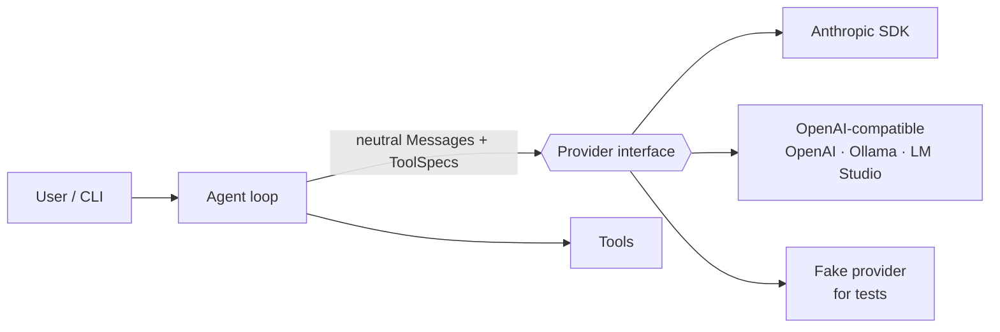

# matchuco

A multi-provider **agentic harness** built from scratch in Python — a learning
project that reimplements the core ideas behind
[Claude Code](https://code.claude.com/docs/en/how-claude-code-works): the
agentic loop, tools, permissions, context management, sessions, subagents,
hooks, skills, MCP and evals.

> An *agentic harness* is the layer around a model that gives it tools and
> manages what it sees. The model reasons; the harness acts.

## Status

| Phase | Topic | Status |
| --- | --- | --- |
| 0 | Project setup (uv, ruff, mypy, pytest, CI) | ✅ |
| 1 | Provider abstraction: Anthropic, OpenAI-compatible (OpenAI, Ollama, ...), fake | ✅ |
| 2 | Agentic loop + core tools (read, write, edit, glob, grep, shell) | ⏳ |
| 3 | Permissions and modes (manual, accept-edits, plan) | ⏳ |
| 4 | Context engineering: CLAUDE.md/AGENTS.md, token tracking, compaction, caching | ⏳ |
| 5 | Sessions (JSONL), resume/fork, checkpoints + rewind, auto memory | ⏳ |
| 6 | Subagents | ⏳ |
| 7 | Hooks and skills | ⏳ |
| 8 | MCP client | ⏳ |
| 9 | Evals | ⏳ |

## Architecture



The whole harness works on **provider-neutral types**
([`messages.py`](src/matchuco/messages.py)): `Message`s made of `TextBlock`,
`ToolUseBlock`, `ToolResultBlock`, `ThinkingBlock` and `OpaqueBlock`. Each
provider adapter translates to and from its wire format and streams back
`TextDelta` / `ThinkingDelta` / `ToolUseStart` events, ending with `Done`.

## Quickstart

Requires [uv](https://docs.astral.sh/uv/).

```bash
uv sync
cp .env.example .env   # add ANTHROPIC_API_KEY and/or OPENAI_API_KEY
uv run matchuco                         # interactive chat (default: anthropic)
uv run matchuco --provider openai       # gpt-5.4-mini by default
uv run matchuco --provider ollama --model qwen3-coder   # local, free
uv run matchuco --provider fake -p "hi" # no API key needed
```

## Development

```bash
uv run pytest        # tests run offline against the fake provider and SDK types
uv run ruff check .
uv run mypy          # strict mode
```

## Learning notes

Each phase has a write-up (in Portuguese) explaining the concept behind it:
[`docs/`](docs/).

## License

MIT
