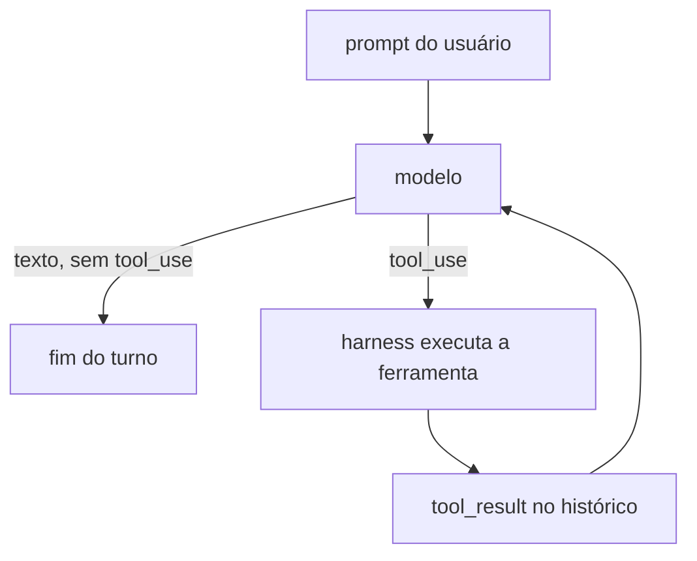

# 02 — O loop agentic e as ferramentas centrais

> Referência: [Como Claude Code funciona](https://code.claude.com/docs/pt/how-claude-code-works)

Na Fase 1 a harness só conversava. Aqui ela passa a **agir**: o modelo pede
ferramentas, a harness executa e devolve o resultado, e isso se repete até o
modelo considerar a tarefa terminada.

## O loop em si

O núcleo cabe em cinco linhas de pseudocódigo
([`agent.py`](../src/matchuco/agent.py)):

```
enquanto (passos < max_steps):
    resposta = provedor.stream(system, histórico, specs_das_ferramentas)
    histórico.append(resposta)
    se resposta não pediu ferramentas: fim do turno
    para cada tool_use: executa e coleta o tool_result
    histórico.append(user(tool_results))
```



Três detalhes decidem se esse loop é utilizável ou não.

### 1. Erro de ferramenta não é exceção

Arquivo inexistente, regex inválida, `exit code 1` no build: nada disso levanta
exceção no loop. O `ToolRegistry` transforma qualquer `ToolError` em um
`ToolResultBlock` com `is_error=True`, que volta para o modelo como texto.

Isso é o que dá **autocorreção**. Um modelo que recebe
`old_string não encontrado; leia o arquivo de novo` lê o arquivo de novo. Um
modelo que recebe um traceback da harness não recebe nada — o programa morreu.

A única coisa que interrompe o loop é falha do *provedor* (rede, API key,
rate limit), porque aí não há o que o modelo possa fazer.

### 2. Limite de passos

Modelos entram em loop: leem o mesmo arquivo dez vezes, repetem um comando que
falha. `max_steps` (padrão 50) é o disjuntor. Sem ele, um bug de prompt vira
uma conta de API.

### 3. Histórico sempre válido

As APIs rejeitam um histórico em que um `tool_use` ficou sem o `tool_result`
correspondente. Se o turno morre no meio — Ctrl-C, erro de rede — o histórico
fica quebrado e **todos** os prompts seguintes falham.

`_repair_history` resolve isso desmontando o final incompleto: remove mensagens
até que a última seja do assistant sem `tool_use` pendente. Na prática, um turno
interrompido é desfeito inteiro.

### Por que eventos em vez de `print`

O loop devolve um `AsyncIterator[AgentEvent]`: `TextDelta`, `ThinkingDelta`,
`ToolStarted`, `ToolFinished`, `TurnEnd`. O [`cli.py`](../src/matchuco/cli.py)
é só um renderizador desses eventos.

Isso mantém o loop testável sem terminal, e é o encaixe das fases seguintes: as
permissões da Fase 3 entram entre `ToolStarted` e a execução; as sessões da
Fase 5 gravam os mesmos eventos em JSONL; os subagents da Fase 6 consomem o
stream de outro `Agent`.

## As ferramentas

| Ferramenta | Para quê |
| --- | --- |
| `glob` | achar arquivos por nome (`**/*.py`) |
| `grep` | achar texto dentro dos arquivos |
| `read` | ler um arquivo com números de linha |
| `edit` | trocar uma string exata |
| `write` | escrever o arquivo inteiro |
| `shell` | rodar qualquer comando |

### Uma ferramenta = descrição + JSON Schema + código

O modelo não vê o código: vê o `name`, a `description` e o `input_schema`. Em
[`tools/base.py`](../src/matchuco/tools/base.py) cada ferramenta declara um
modelo pydantic para a entrada, e o schema e a validação saem da mesma fonte.
Não dá para os dois divergirem.

A **descrição é prompt**. `"Search file contents with a regular expression"`
não basta; a descrição do `grep` também diz *quando* usá-lo ("use this to find
code before reading whole files"), porque a alternativa que o modelo escolheria
é ler a árvore inteira e queimar a janela de contexto.

### Regra de ler-antes-de-escrever

`write` e `edit` recusam um arquivo que o modelo não leu nesta sessão, e
recusam um arquivo que mudou no disco depois da leitura
(`ToolContext.check_readable_before_write`).

O motivo é concreto: um modelo que "sabe" o que tem num arquivo sem ter olhado
sobrescreve trabalho real. A regra transforma um erro silencioso e destrutivo
numa mensagem de erro recuperável.

### Por que `edit` usa string exata, e não número de linha

Número de linha desatualiza a cada edição anterior no mesmo turno. Um trecho
único de texto, não. Por isso `edit` exige que `old_string` case byte a byte e
**recusa correspondências ambíguas**: se o trecho aparece três vezes, o modelo
precisa incluir linhas de contexto ou pedir `replace_all` explicitamente.
Trocar a ocorrência errada é pior do que falhar.

### Limites de saída

Toda ferramenta corta a saída: `read` pagina em 2000 linhas, `grep` mostra 100
matches, `glob` 200 arquivos, `shell` 30 mil caracteres. A janela de contexto é
o recurso escasso da harness — uma única chamada não pode consumi-la. E o corte
sempre avisa quanto sobrou, para o modelo saber que precisa paginar.

### `glob`/`grep` em Python puro

Sem depender de `rg` ou `fd`: a harness precisa se comportar igual numa máquina
que não tem nenhum dos dois, e os testes não podem depender do que está
instalado. O custo é velocidade em árvores grandes, que os limites de resultado
seguram. Ambos pulam `.git/`, `node_modules/`, `__pycache__` e afins — ruído
nesses diretórios custa contexto e não ajuda ninguém.

### `shell`: o mais útil e o mais perigoso

stdout e stderr vão **misturados**, porque o modelo precisa da mensagem de erro
ao lado da saída que a produziu. O exit code sempre aparece, e um código
diferente de zero volta como erro — senão o modelo lê um build quebrado como
sucesso.

Por enquanto as únicas travas são o timeout e o cap de saída: `shell` roda
`rm -rf` sem perguntar. A Fase 3 põe isso atrás de modos de permissão
(veja [03-permissoes.md](03-permissoes.md)).

## Fronteira do workspace

`ToolContext.resolve()` resolve todo caminho contra a raiz do workspace e
rejeita o que escapa. É uma regra grosseira — e provisória, a Fase 3 a
substitui — mas impede que um `../../.ssh/id_rsa` alucinado esteja a uma
chamada de distância.

## O que ficou de fora

- **Ferramentas em paralelo**: quando o modelo pede várias de uma vez, a
  harness executa em sequência. O Claude Code paraleliza as de leitura. Fica
  para depois; determinismo agora vale mais que latência.
- **Permissões**: Fase 3.
- **CLAUDE.md no system prompt**: Fase 4.

## Testando sem rede

O `FakeProvider` recebe um roteiro de turnos, inclusive `tool_use`. Assim o
loop inteiro — inclusive paralelismo, erro de ferramenta, limite de passos e
reparo do histórico — é testado offline, sem API key e sem gastar token.
Onde o `FakeProvider` não chega (o `stop_reason: pause_turn`), um provedor de
três linhas no próprio teste resolve.
